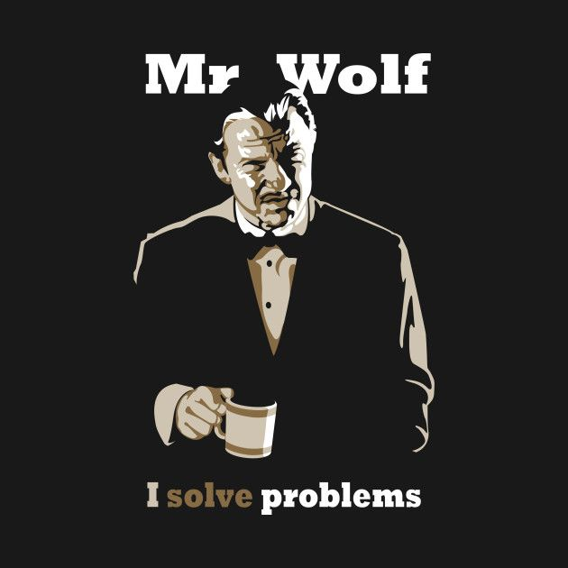
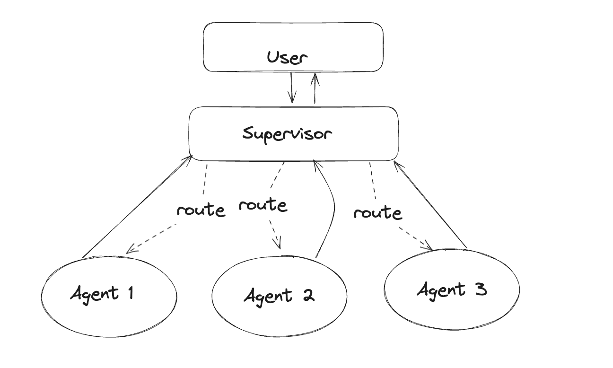

# Mr Wolf - exploring agentic systems

## Overview
The main goal is to explore the space of AI Agents and Agentic systems and finally build something end-to-end so that, with the confidence that only comes from doing, I can tell what's real and what works instead of feeling lost between the market hype and the research papers. All of this while building a personal assistant, and who better than Mr Wolf... the character from Pulp Fiction whose famous line is *[I solve problems](https://www.youtube.com/watch?v=ZN12-hJI7ws)*.

While the aim is to create something that can be used, and therefore tested, in real-life (instead of benchmarks), the project is ultimately focused on technical exploration with several specific goals:

- **RAG**: Going beyond simple vectorization and cosine similarity tutorials to explore the complexities of ingesting a variety of documents (understanding special formats, how to deal with tabular data, parsing and chunking choices) to retrieval mechanisms (reranking, hybrid search, etc)
- **Prompting, agent collaboration and ReACT strategies**: Investigating how effectively multiple bots can collaborate, how prompting affects final results, and testing different prompts and models (hopefully with an A/B testing tool similar to [ChainForge](https://chainforge.ai/))
- **Explore multimodal (Voice/Image)**: Learning more about voice, more deeply understanding the challenges and the delta between something high quality like 11Labs with common solutions such as AWS Polly, plus exploring image genereration with new models like Flux.
- **Hallucination**: how frequent they actually are and how much can they really be curbed
- **Memory and self-learning**: short and long term, how to get models to remember without getting confused and learn and improve as they work and get feedback
- **CaLM and conversational AI**: what's the best way to implement deterministic workflows? does eveyrything need a LLM? (it does not, but then what exactly?). [CaLM](https://rasa.com/docs/learn/concepts/calm/) looks like a very reasonable approach, but needs exploring.
- **Costs and failures**: Measuring real-world agent failure rates and operational costs with normal daily usage, especially with ASR/TTS

Part of the fun and exploration will also be to use GH Copilot and other AI coding tools like Claude Code to see how it works on a full project as opposed little scripts which is all I've used these tools for so far.

## Tech Stack
To focus on AI rather than plumbing and ensure immediate mobile access, the project makes several opinionated technology choices:

- [Docker](https://www.docker.com) for local development
- [n8n](https://n8n.io) as a lowcode solution to model agents and connect to 3rd party services. It also aligns with my basic mental framework of workflows as agents.
- [PostgreSQL](https://www.postgresql.org) as the primary database
  - Compatible with n8n, supports embeddings via [pgvector](https://github.com/pgvector/pgvector) extension and enables hybrid search
  - [pgAdmin](https://www.pgadmin.org) included for database exploration
- [Telegram](https://telegram.org) as the communication channel, saves us having to build a UI to start with and allows for all sorts of media interaction on any devide
- [Metabase](https://www.metabase.com) for easy observability from day one, makes it a breeze to create any dashboard
- [Ollama](https://ollama.com) for local development and fast iterations (llama.cpp seems would have been better, but too troublesome to get working). For more power possibly [Bedrock](https://aws.amazon.com/bedrock/) for easy LLM access without needing 20 accounts, LLama 3 for the most, cohere for embeddings and reranking, stability for images, Polly/Transcribe for voice. Alternatively openAI, which would provide all but reranking I think. Either should be a solid baseline that can be taken to production with ease and then used for comparison with other models.

## Non-Focus Areas
The project currently does not focus on:

- Latency and scalability, although these ultimately make a significant difference
- Realtime/streaming, particularly for voice (the current implementation uses audio messages rather than calls, and n8n doesn't support streaming)

## System Design

This project is focused on the director->subagents->tasks model. In this design a main agent receives the incoming queries and decides which agent to delegate to which eventually performs the tasks and returns to the director agent. One of the things to clarify is who does the evaluation, if every subagent has a companion agent for evaluations or not, perhaps using a different model, but otherwise the design should be pretty straightforward. All agents will be implemented as their own flow with the director flow calling the other flows.

One more thing that's also discussed in the resources below is the human in the loop. The project will explore how to get feedback, but also permissions from humans to proceed with a certain set of actions.

These are a couple resources that clearly explain the model, one implemented on N8N (his flows will be included in the default repo) and another with another platform, Relevance AI:

Nate Herk - I Built the Ultimate Team of AI Agents in n8n With No Code (Free Template)

Ben AI - This 20+ AI Agent Team Automates ALL Your Work (GPT-01) (Relevance AI)

(...yes, everything and anything... welcome to the hype and clickbait)

Something like that will represent the backbone and the baseline, but then the real work begins to go in depth on the above topics and try to implement  more complex RAG solutions, try different prompts and so on.

## Getting Started
I began with docker, but found it faster to hack on things if I installed locally with brew, especially when using ngrok or whisper, too much overhead setting everything up in docker. Still got some stuff left around that I may pick up later once I clean things up and try to make it easier for distribution, if I ever get there.

### Docker
You need docker installed, then just checkout this repo and run docker-compose -f docker/docker-compose.yml up -d and you should see 4 containers showing up:

- postgres
- n8n
- pgadmin
- metabase

### Source
Assuming dev on Mac with brew available. Setting up brew is beyond the scope of this. N8N uses the LTS version of node so you will most likely need NVM.

For N8N:
- brew uninstall --force node if you'd like to avoid falling for a default
- brew install nvm
- add the stuff to your shell profile as indicated in the ouput of the installation
- nvm install v18.17.0
- cd n8n
- npm install n8n nodemon  (local install, not global)
- npm run dev
- note that by default n8n will use a local sqlite db which is kind of nice for testing
- when connecting to ollama you need to use 127.0.0.1 instead of localhost, seems that otherwise ipv6 messes stuff up
- you will also need to setup ngrok below and configure the webhook url if you want to be able to connect telegram or other services from outside

For ngrok, which you need if you want to connect telegram to N8N:
- you need to register on ngrok.com . It's free for just HTTP and ephemeral domain, but it does require registration
- brew install ngrok
- follow the instructions to connect your ngrok client to their platform (need token auth)
- claim a free domain, easier than random ip numbers
- run ngrok with your customer domain as a parameter and watch the magic happening
- this is a good video with all the steps: https://www.youtube.com/watch?v=3sshIaiotmc

For Ollama:
- brew install ollama
- ollama serve (you can also use brew brew services start ollama and set it up to autostart if you'd like)
- ollama pull {llama3.2:latest, nomic-embed-text:latest, deepseek-r1:14b}
- ollama run llama3.2 if you wanna test it

For postgresl:
- brew install postgresql
- brew services start postgresql
- psql postgres to get in and test it
- brew install pgvector
- psql postgres , CREATE EXTENSION vector;

For stt:
- brew install whisper-cpp
- download whatever models you want, I used https://huggingface.co/distil-whisper/distil-large-v3-ggml/tree/main and https://huggingface.co/ggerganov/whisper.cpp/tree/main larger-turbo v3
- brew install ffmpeg if you wanna be able to feed it mp3s, whisper otherwise works off of WAVs
- start the server, whisper-server -m whisper-ggml-distil-large-v3.bin --convert -pp -pr --port 1332 for example, this lets you upload mp3s and prints output in realtime and progress. Note that the client does not support streaming so you will only see a reply once the whole thing is done, but you can watch the server in console outputting stuff. Note by default the server starts on 8080, I changed that.
- test it with any mp3 as this curl: curl -F "file=@/path/to/file.mp3" "http://localhost:1332/inference?timestamp=true"

Besides that, you will need to setup telegram and ngrok so that 

If you are using llama.cpp for local inferencing you most likely want to shut down pgadmin and metabase to get some resources back. It may also make sense to support a mode with N8N running locally with sqlite as default without even docker and no pgsql, but then you need a different vector store, which I'm not sure what it'd buy you mem profile wise over using pgsql.

## Resources and links for exploration
Just keeping track of good articles to explore the above topics:

### LLMs
After failing to get llama.cpp I switched to Ollama and life has been great (it's ironic since ollama uses llama.cpp under the hood... but whatever)
I've downloaded 3 key models from the ollama repo:

- llama 3.2 for chat
- deepseek-r1 for reasoning
- nomadic for mebedding

all models are quantized to 4bit and Q_M for balanced perf and quality. Also on my mac Mini M4 with 16GB ram I can actually run both deepseek at 14B parameters and gemma3 at 12B params without breaking a sweat:

### N8N

- The simplest possible AI agent with N8N and ollama and postgresql for memory: https://www.youtube.com/watch?v=y9m3i12qkms
- Building the Ultimate RAG setup with Contextual Summaries, Sparse Vectors and Reranking https://community.n8n.io/t/building-the-ultimate-rag-setup-with-contextual-summaries-sparse-vectors-and-reranking/54861
- Don't Build Another RAG Agent Until You See This: Anthropic's Contextual RAG Strategy! ~ n8n https://www.youtube.com/watch?v=WUF2roFLDPE
- Trying to add streaming to N8N https://github.com/n8n-io/n8n/pull/11888/commits/4175789afc35d7a4af90b1f65b776ddc0fd9b061
- Starts from the very basics and builds up all the way to agents, really comprehensive: https://www.youtube.com/watch?v=ZHH3sr234zY

### Voice

- How hard is to get voice like this: https://www.sesame.com/research/crossing_the_uncanny_valley_of_voice - model released https://huggingface.co/sesame/csm-1b
- another apparently great option for voice models: https://cartesia.ai/
- Polly voices samples https://www.youtube.com/watch?v=nUX-6_aRvGE and using AI to markup timbre for SSML https://grebler.medium.com/using-generative-ai-for-marking-up-speech-synthesis-78e1b5536c0d
- AWS sample code for polly https://github.com/aws-samples/amazon-bedrock-voice-conversation
- one more on voice conversations: https://lomaky.medium.com/ai-conversation-app-a-multilingual-back-and-forth-voice-conversation-and-data-extraction-angular-e5c8875e695c

### RAG Techniques

- https://github.com/NirDiamant/RAG_Techniques
- See the comment: https://www.skool.com/ai-automation-society/advanced-and-accurate-rag-system-assistance?p=a3206147

### Document ingestion/ETL/Cleanup
- https://github.com/docling-project/docling
- https://docs.llamaindex.ai/en/stable/llama_cloud/llama_parse/
- https://unstructured.io/
- https://unstract.com/

### PG Vector

- https://www.youtube.com/watch?v=Ua6LDIOVN1s
- https://github.com/timescale/busy-dev-pgvector-intro
- https://docs.n8n.io/integrations/builtin/cluster-nodes/root-nodes/n8n-nodes-langchain.vectorstorepgvector/

## Contributing
It's all about exploration because doing is 100 times better than just watching videos and reading stuff, feel free to join, the more the merrier.

## Todo
See open issues and The Stuff project for things to pick up.

### Hackatons
Because stuff is more fun together, as much as possible I'd like to work in burst along with other people, possibly in realtime. As such I will try to organize some period hackatons to move the project forward as on a daily basis I simply don't have enough time between work and family.